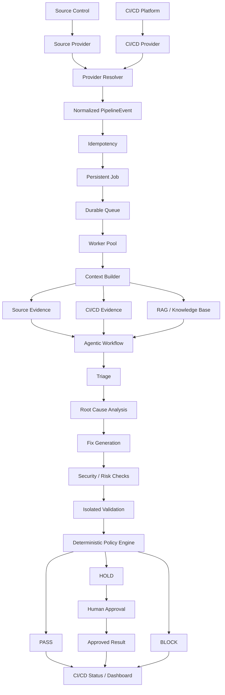
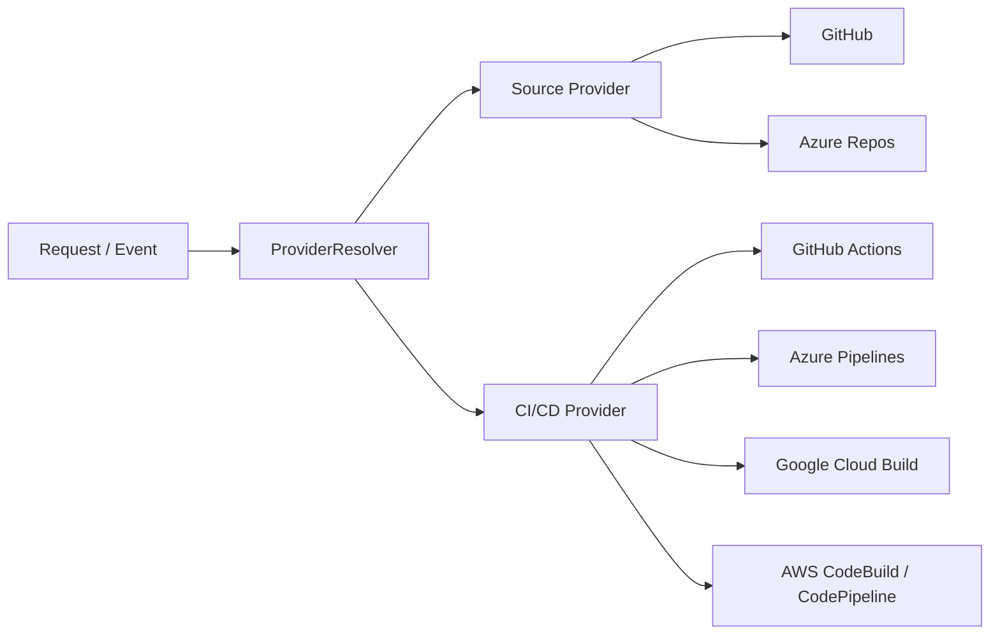
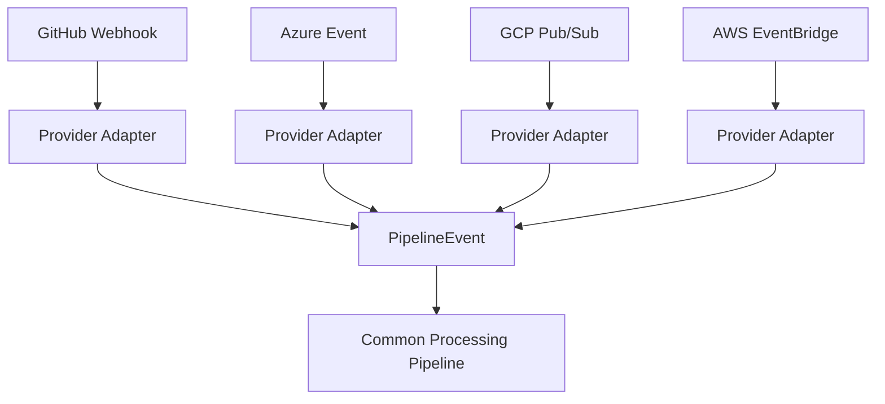
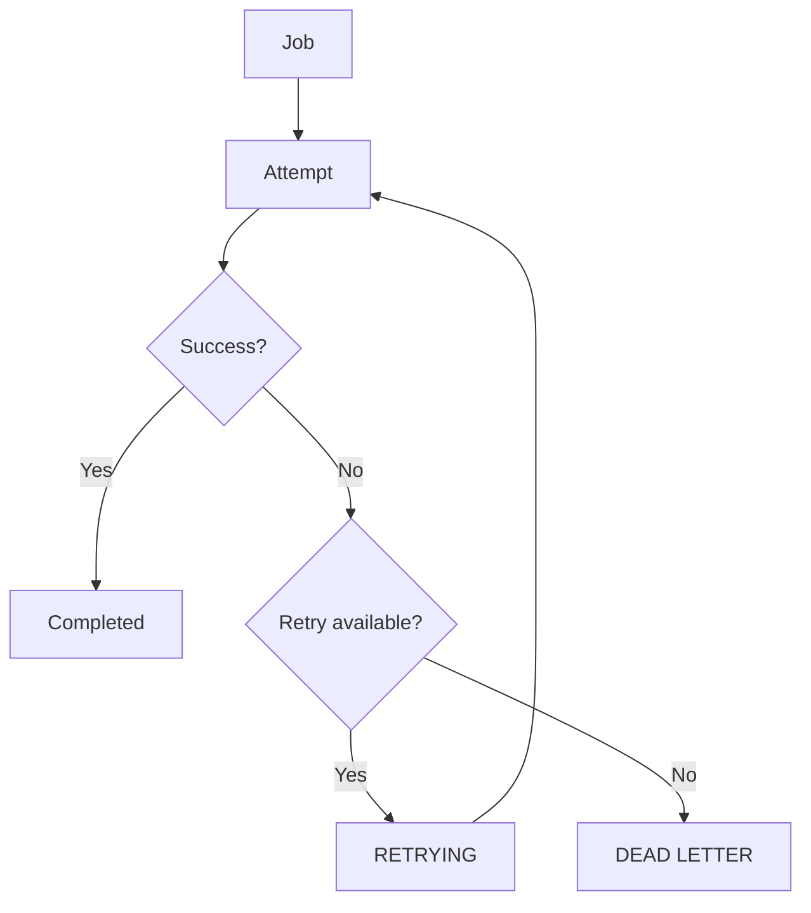
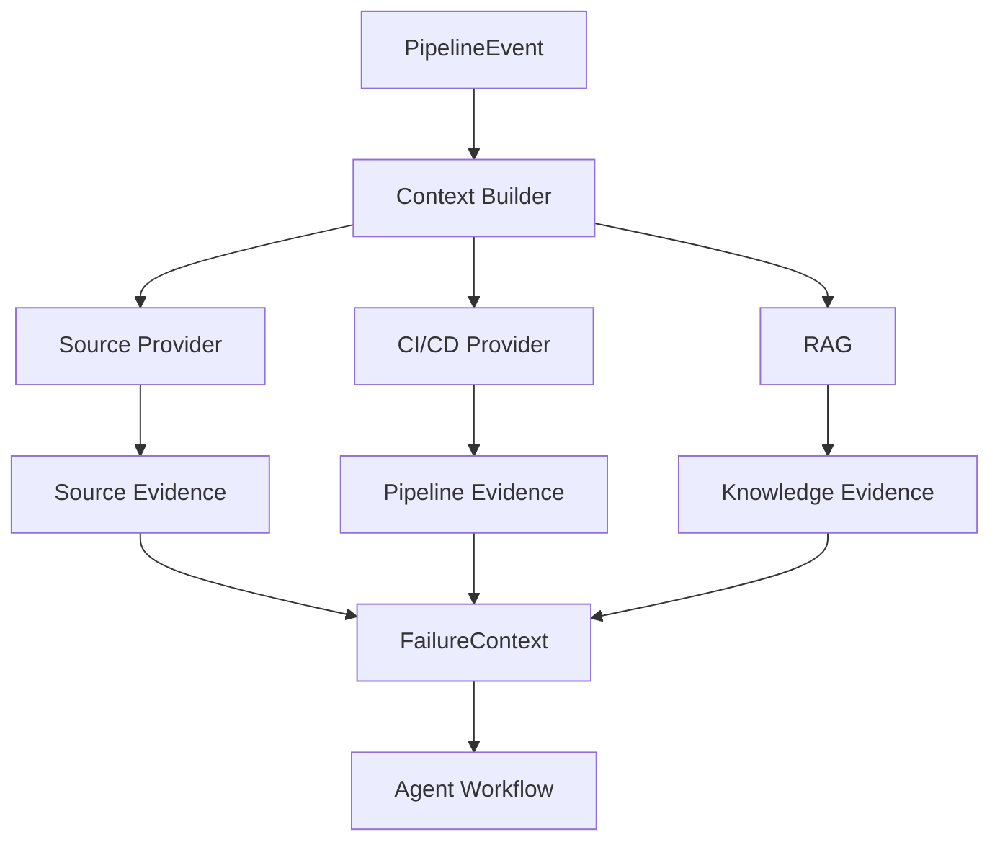
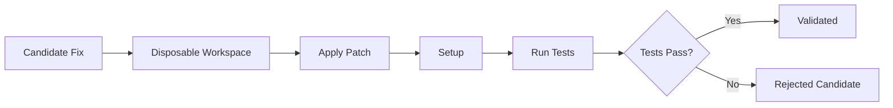
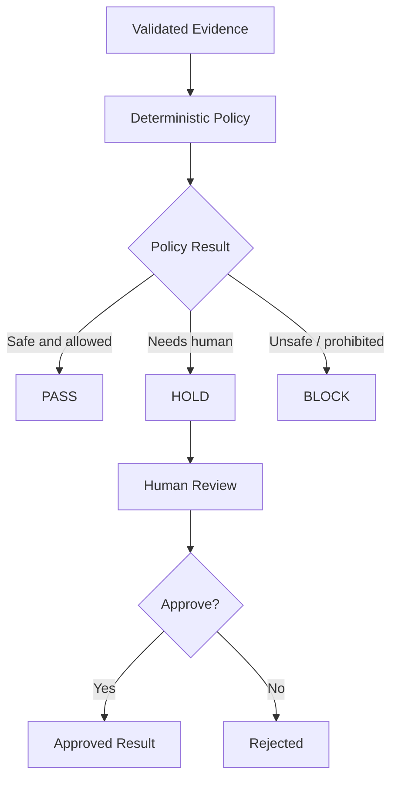
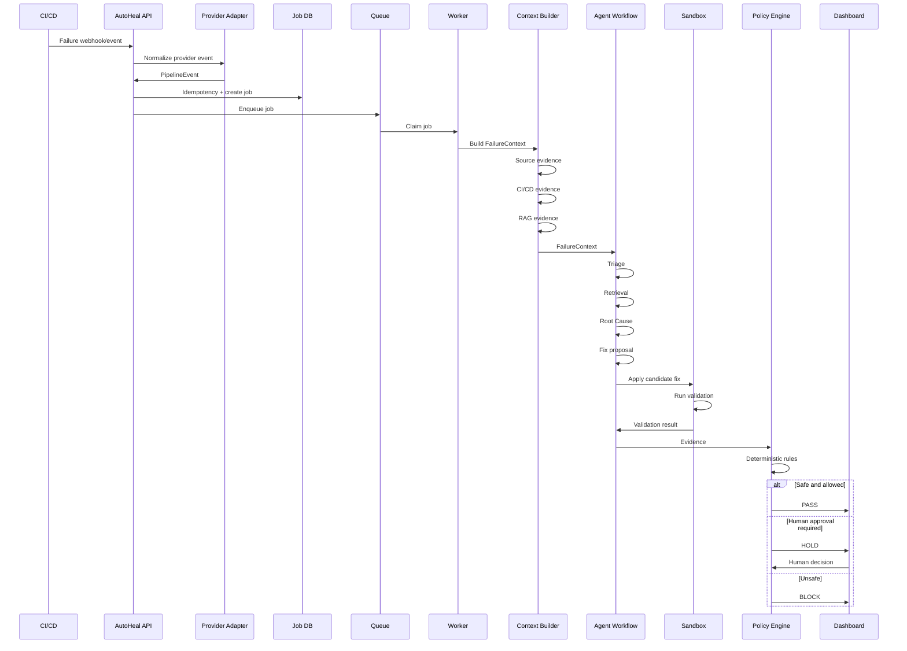

# AutoHeal Gate — Complete Technical Explanation

> **An agentic, provider-neutral CI/CD failure remediation and release-gating platform.**

AutoHeal Gate is not simply a chatbot that reads CI logs and suggests a fix.

The system we have built is a complete pipeline around failure handling:

```text
CI/CD Failure
     ↓
Provider Adapter
     ↓
Normalized Pipeline Event
     ↓
Idempotency
     ↓
Persistent Job
     ↓
Queue
     ↓
Worker
     ↓
Context Builder
     ↓
Source Evidence + CI/CD Evidence + Knowledge
     ↓
Agentic Analysis
     ↓
Root Cause
     ↓
Candidate Fix
     ↓
Security / Risk Checks
     ↓
Isolated Validation
     ↓
Deterministic Policy Engine
     ↓
PASS / HOLD / BLOCK
     ↓
Human Approval when required
```

The most important architectural rule is:

> **The AI produces evidence. A deterministic policy engine decides the release outcome.**

---

# 1. What Problem Are We Solving?

A normal CI/CD system looks approximately like:

```text
Developer
   │
   ▼
Git Push / Pull Request
   │
   ▼
CI/CD Pipeline
   │
   ├── Build
   ├── Test
   ├── Lint
   └── Security Checks
   │
   ▼
 ┌───────────────┐
 │ PASS / FAIL   │
 └───────────────┘
        │
        └── FAIL
             ↓
        Developer investigates
             ↓
        Finds root cause
             ↓
        Changes code
             ↓
        Pushes again
             ↓
        CI runs again
```

The problem is the manual loop after failure.

AutoHeal introduces an automated investigation layer:

```text
                         AUTOHEAL GATE
                              │
                              ▼
CI/CD ──────── Failure ──► Investigate
                              │
                              ▼
                       Understand failure
                              │
                              ▼
                       Find root cause
                              │
                              ▼
                      Propose remediation
                              │
                              ▼
                       Validate remediation
                              │
                              ▼
                       Evaluate risk/policy
                              │
                  ┌───────────┼───────────┐
                  ▼           ▼           ▼
                PASS         HOLD        BLOCK
                              │
                              ▼
                       Human approval
```

The goal is not to blindly let an LLM modify production code.

The goal is to automate the repetitive investigation and validation work while keeping the final release decision controlled.

---

# 2. What Has Actually Been Built?

The project evolved through 15 phases.

At the beginning, the application was much more GitHub-centric.

We progressively transformed it into:

```text
GitHub-centric gate
        ↓
Provider abstraction
        ↓
Multi-provider gate
        ↓
Provider-independent events
        ↓
Separate source/CI retrieval
        ↓
Persistent event ingestion
        ↓
Queue + workers
        ↓
Durable jobs + retries
        ↓
Horizontal scaling
        ↓
Per-job validation isolation
        ↓
Observability
        ↓
Security controls
        ↓
Cross-provider integration testing
        ↓
Operational frontend
        ↓
Final documentation
```

So the important story of the project is not just "we added four cloud providers."

It is:

> **We progressively separated concerns so the system can ingest failures from different CI/CD platforms, process them asynchronously, build provider-neutral context, analyze them, validate candidate fixes safely, and make a deterministic release decision.**

---

# 3. Complete System Architecture



---

# 4. The Four Most Important Architectural Ideas

Four architectural ideas shaped the later AutoHeal design.

They are complementary, not competing alternatives.

```text
                    AutoHeal Architecture
                           │
       ┌───────────────────┼───────────────────┐
       │                   │                   │
       ▼                   ▼                   ▼
Provider Adapters    Event-First        Separate Source
                     Architecture       & CI Retrieval
       │                   │                   │
       └───────────────────┼───────────────────┘
                           ▼
                    Context Builder
                           │
                           ▼
                    Agentic Workflow
```

## 4.1 Provider Adapters

Different systems expose different APIs and event formats.

Instead of writing:

```python
if github:
    ...
elif azure:
    ...
elif gcp:
    ...
elif aws:
    ...
```

throughout the entire application, we introduced provider interfaces.

```text
                 Provider Interfaces
                        │
          ┌─────────────┴─────────────┐
          ▼                           ▼
   SourceProvider              CICDProvider
          │                           │
     ┌────┴────┐             ┌────────┼────────┐
     ▼         ▼             ▼        ▼        ▼
  GitHub    Azure          GitHub    Azure     GCP/AWS
                           Actions   Pipelines
```

This keeps provider-specific API code at the edge.

---

# 5. Source Provider vs CI/CD Provider

This is one of the most important changes in the project.

It is incorrect to assume:

```text
GitHub Repository → GitHub Actions
Azure Repository  → Azure Pipelines
```

Real organizations can use combinations.

For example:

```text
                    CI/CD
              ┌──────┼──────┬──────┐
              ▼      ▼      ▼      ▼
           GitHub  Azure   GCP    AWS
           Actions Pipelines Build  CodeBuild
              ▲      ▲      ▲      ▲
              │      │      │      │
              └──────┴──────┴──────┘
                       │
                    Source
                 GitHub / Azure
```

Examples supported by the architecture:

```text
GitHub Repo + GitHub Actions
GitHub Repo + Azure Pipelines
GitHub Repo + Google Cloud Build
GitHub Repo + AWS

Azure Repos + Azure Pipelines
Azure Repos + Google Cloud Build
Azure Repos + AWS
```

This is why we have two provider concepts:

```text
SourceProvider
    ↓
repository / files / commits / branches / PRs

CICDProvider
    ↓
pipeline / run / logs / status / artifacts
```

---

# 6. ProviderResolver

The `ProviderResolver` is responsible for turning provider identity into the correct implementation.



This prevents the gate service from directly depending on a particular cloud provider.

The gate asks for a provider capability rather than directly creating a GitHub client.

---

# 7. Provider Capabilities

Different providers support different operations.

Therefore AutoHeal exposes capability information.

Conceptually:

```text
Provider
   │
   ├── get_logs
   ├── get_artifacts
   ├── publish_status
   ├── create_pr
   └── rerun_pipeline
```

The important rule is:

> **Do not advertise functionality that the adapter does not actually implement.**

For example:

```text
GitHub
 ├── Logs             ✓
 ├── Status           ✓
 ├── PR               ✓
 └── Rerun            depends on implementation
```

The frontend System screen can display these capabilities without exposing credentials.

---

# 8. Provider Webhooks

Each platform can send events in its own format.

For example:

```text
GitHub webhook
Azure DevOps event
GCP Pub/Sub message
AWS EventBridge event
```

AutoHeal converts them into one internal representation.



The agent layer therefore does not need to understand every provider's webhook schema.

---

# 9. PipelineEvent

The common event contains information such as:

```text
provider
source_provider
cicd_provider
repository
commit_sha
branch
pipeline_id
run_id
change_request_number
status
organization
project
metadata
raw_payload
ci_passed
is_cross_provider
```

The important property is that:

```text
source_provider
```

and:

```text
cicd_provider
```

are independent.

This is what makes cross-provider combinations possible.

---

# 10. Event-First Architecture

Instead of processing provider requests directly inside the business logic:

```text
Webhook
   ↓
Gate Service
   ↓
Agents
```

we introduced an event boundary:

```text
Webhook
   ↓
Normalize
   ↓
PipelineEvent
   ↓
Idempotency
   ↓
Job
   ↓
Queue
   ↓
Worker
```

This gives us:

- retryability
- asynchronous processing
- durable state
- provider independence
- horizontal scaling
- observability
- easier testing

---

# 11. Idempotency

Webhooks can be delivered more than once.

Without idempotency:

```text
Webhook
   │
   ├── Delivery #1 → Job 1
   └── Delivery #2 → Job 2
```

The same failure could be processed twice.

With idempotency:

```text
                 Event
                   │
                   ▼
             Identity Key
                   │
          ┌────────┴────────┐
          ▼                 ▼
       Existing?          New?
          │                 │
          ▼                 ▼
       Ignore            Process
```

The system stores event identity persistently and uses an atomic uniqueness constraint.

Provider-specific identity is used where available:

```text
GitHub → delivery identity
Azure  → build/event identity
GCP    → Pub/Sub messageId
AWS    → EventBridge identity
```

---

# 12. Queue and Workers

We do not want a webhook request to perform the entire AI remediation workflow synchronously.

Instead:

```text
HTTP/Webhook
     │
     ▼
Create/record job
     │
     ▼
Queue
     │
     ▼
Worker
     │
     ▼
Long-running processing
```

This is much safer for long-running analysis.

Multiple workers can process independent jobs:

```text
                Queue
                  │
        ┌─────────┼─────────┐
        ▼         ▼         ▼
     Worker 1  Worker 2  Worker 3
        │         │         │
       Job A     Job B     Job C
```

A worker failure should not destroy unrelated jobs.

---

# 13. Persistent Job State

A major change was moving from transient processing toward durable jobs.

Conceptually:

```text
Webhook
   ↓
Job created
   ↓
QUEUED
   ↓
RUNNING
   ↓
CONTEXT_BUILDING
   ↓
ANALYZING
   ↓
RCA
   ↓
FIXING
   ↓
VALIDATING
   ↓
WAITING_FOR_APPROVAL
   ↓
COMPLETED
```

Failure paths can lead to:

```text
FAILED
RETRYING
DEAD_LETTER
```

The system can recover unfinished work after a restart.

---

# 14. Retry and Dead Letter Flow



This prevents transient failures from immediately becoming permanent failures.

It also prevents infinite retries.

---

# 15. Horizontal Scaling

The API layer is designed to be stateless enough for multiple instances.

```text
                    Load Balancer
                         │
              ┌──────────┼──────────┐
              ▼          ▼          ▼
            API 1      API 2      API 3
              └──────────┼──────────┘
                         ▼
                  Shared Job State
                         │
              ┌──────────┼──────────┐
              ▼          ▼          ▼
          Worker 1   Worker 2   Worker 3
```

The persistent job state is the coordination point.

Workers atomically claim jobs so multiple workers should not process the same job concurrently.

For a production multi-instance deployment:

```text
Local SQLite
     ↓
Shared PostgreSQL
```

is the natural database transition.

---

# 16. Per-Job Sandbox

This is critical because AutoHeal may execute tests against a candidate patch.

We do not want:

```text
Job A
   ↓
modify user's actual working tree
```

Instead:

```text
Repository
    │
    ▼
Disposable Workspace
    │
    ├── Candidate Patch
    │
    └── Tests
```

Multiple jobs receive independent directories:

```text
WORKSPACE_ROOT/
└── jobs/
    ├── job_A/
    │   └── attempt_001/
    │
    ├── job_B/
    │   └── attempt_001/
    │
    └── job_C/
        └── attempt_002/
```

This prevents one validation job from overwriting another job's files.

The workspace is cleaned after validation.

---

# 17. Context Builder

The Context Builder is the bridge between infrastructure and AI.

Instead of giving the agent random pieces of information:

```text
logs
diff
repository
pipeline
```

we construct a structured failure context.



This is important because the agent workflow should consume a provider-neutral context rather than provider-specific API objects.

---

# 18. Why Separate Source and CI Evidence?

Suppose:

```text
Source:
GitHub

CI/CD:
Azure Pipelines
```

The source provider needs to answer:

```text
What code was committed?
What files changed?
What is the repository?
What is the current commit?
```

The CI/CD provider needs to answer:

```text
Which pipeline failed?
Which job failed?
What were the logs?
What was the pipeline status?
```

These are different responsibilities.

```text
                 Failure Context
                       │
              ┌────────┴────────┐
              ▼                 ▼
       Source Evidence      CI/CD Evidence
              │                 │
          GitHub/Azure       GitHub/Azure/GCP/AWS
```

This separation was one of the key architecture improvements.

---

# 19. Agentic Failure Analysis

Once the failure context is assembled:

```text
FailureContext
      │
      ▼
    Triage
      │
      ▼
   Retrieval
      │
      ▼
 Root Cause
      │
      ▼
     Fix
      │
      ▼
 Validation
```

The agents are not independent chatbots randomly talking to one another.

They form a controlled workflow.

---

# 20. Triage

Triage answers:

> What kind of failure is this?

Examples:

```text
Assertion failure
Import error
Dependency conflict
Timeout
Configuration issue
Flaky test
Security finding
```

The classification determines what information is useful downstream.

---

# 21. RAG / Retrieval

AutoHeal has a local knowledge base.

```text
Knowledge Base
      │
      ├── Runbooks
      ├── Incident notes
      ├── Failure patterns
      └── Troubleshooting information
      │
      ▼
   Retriever
      │
      ▼
Relevant context
      │
      ▼
Root Cause / Fix
```

RAG is used as supporting evidence.

It does not override the actual pipeline logs.

---

# 22. Root Cause Analysis

The RCA stage combines:

```text
Current failure logs
+
Source evidence
+
Pipeline evidence
+
Retrieved knowledge
```

to answer:

```text
What actually caused the failure?
```

It may identify:

```text
likely_files
root cause
supporting evidence
failure category
```

The important design decision is to ground the analysis in the current failure rather than only relying on generic retrieved knowledge.

---

# 23. Fix Generation

The fix stage attempts to produce a remediation.

The safety design is:

```text
RCA identifies file
       ↓
Read actual file
       ↓
Give relevant source to model
       ↓
Model proposes corrected content
       ↓
Compute deterministic diff
```

The model is not allowed to claim:

```text
"I changed calculator.py"
```

without the system comparing actual source content.

The resulting diff is computed by the application.

---

# 24. Validation

The candidate fix then enters the sandbox.



A candidate fix that looks good but fails validation is not treated as a successful remediation.

---

# 25. Security Checks Before/around Validation

Security controls were added around the remediation path.

The system checks for things such as:

```text
dangerous commands
destructive filesystem operations
git push
network downloads
credential/control-plane operations
path traversal
sensitive data
```

The purpose is to prevent an AI-generated remediation or validation instruction from turning into unrestricted host activity.

---

# 26. Deterministic Policy

This is the final safety boundary.

The model may say:

```text
"I believe the root cause is X."
"I suggest changing Y."
```

But it cannot say:

```text
"Therefore release."
```

Instead:

```text
Evidence
   ↓
Policy Rules
   ↓
Verdict
```

Example:

```text
Tests pass
        +
No protected paths changed
        +
No secrets introduced
        +
No test files modified
        +
Policy allows automation
        ↓
       PASS
```

Another example:

```text
Tests pass
        +
Fix looks valid
        +
Human approval required
        ↓
       HOLD
```

Another:

```text
Candidate changes test file
        ↓
      BLOCK
```

---

# 27. PASS / HOLD / BLOCK

The decision model is:



The important point is that:

```text
LLM ≠ final authority
```

---

# 28. Human-in-the-Loop

By default, automated remediation can require human approval.

```text
Failure
  ↓
AI analysis
  ↓
Candidate fix
  ↓
Validation PASS
  ↓
Policy
  ↓
HOLD
  ↓
Human review
  ├── Approve
  └── Reject
```

If approved, the system can continue with the configured result flow.

This makes the system suitable for controlled remediation rather than unrestricted autonomous production changes.

---

# 29. Authentication Architecture

There are two different concepts.

## Dashboard authentication

Currently:

```text
User
 ↓
GitHub OAuth
 ↓
AutoHeal session
 ↓
Dashboard
```

The OAuth token is handled server-side.

The browser receives an opaque session identifier rather than the provider access token.

---

## CI authentication

A CI runner cannot normally complete a browser OAuth flow.

Therefore:

```text
Dashboard
   ↓
Create API Key
   ↓
CI Secret Store
   ↓
X-API-Key
   ↓
AutoHeal API
```

This separates browser authentication from CI invocation.

---

# 30. Provider Credentials vs User Login

This distinction is important when explaining the architecture.

```text
                 AUTOHEAL
                    │
        ┌───────────┴───────────┐
        ▼                       ▼
 User Authentication      Provider Credentials
        │                       │
   GitHub OAuth          GitHub / Azure / GCP / AWS
        │                       │
        ▼                       ▼
    Dashboard             Source / CI access
```

The current application login is GitHub OAuth.

That does **not** mean:

```text
Azure unsupported
GCP unsupported
AWS unsupported
```

Those providers exist in the backend provider architecture.

Adding Microsoft Entra, Google OIDC, or AWS identity login to the dashboard would be a separate authentication expansion.

---

# 31. Observability

Phase 11 added OpenTelemetry + Phoenix.

The tracing model follows the processing path:

```text
Webhook
   ↓
Event Ingestion
   ↓
Idempotency
   ↓
Queue
   ↓
Worker
   ↓
Context Builder
   ↓
Source Retrieval
   ↓
CI/CD Retrieval
   ↓
RAG
   ↓
LangGraph
   ↓
RCA
   ↓
Fix
   ↓
Validation
```

Important correlation information includes:

```text
job.id
event.id
provider
pipeline/run ID
worker index
duration
trace context
```

---

# 32. Trace Propagation

A distributed job should not lose its trace identity when moving through the queue.

Conceptually:

```text
HTTP Request
     │
     │ traceparent
     ▼
Pipeline Event
     │
     │ traceparent
     ▼
Queue
     │
     │ traceparent
     ▼
Worker
     │
     ▼
Agent Workflow
```

This makes it possible to inspect one failure across multiple processing stages.

---

# 33. Frontend

The frontend is built using:

```text
React
Vite
```

The dashboard provides operational views such as:

```text
Runs
Repositories
System
Jobs
Provider capabilities
Approvals
Statistics
API keys
```

The System screen connects the architecture to an operational view.

For example:

```text
SYSTEM
─────────────────────────────────
Backend           Healthy
Queue             Running
Workers           4
Queued Jobs       3
Running Jobs      2
Retrying Jobs     1
Dead Letter       0

Providers
─────────────────────────────────
GitHub            ✓
Azure             ✓
Google Cloud      ✓
AWS               ✓
```

The dashboard is intended to show operational state, not expose secrets.

---

# 34. Complete Runtime Flow

Here is the complete flow from an actual CI failure to the final decision.



---

# 35. Complete Data Flow

```text
                 EXTERNAL WORLD
                       │
       ┌───────────────┼────────────────┐
       ▼               ▼                ▼
    GitHub           Azure             GCP/AWS
       │               │                │
       └───────────────┼────────────────┘
                       ▼
                Provider Adapter
                       │
                       ▼
                PipelineEvent
                       │
                       ▼
                 Idempotency
                       │
                       ▼
                 Persistent Job
                       │
                       ▼
                    Queue
                       │
                       ▼
                    Worker
                       │
                       ▼
               Context Builder
                  /          \
                 /            \
                ▼              ▼
         Source Evidence   CI Evidence
                \              /
                 \            /
                  ▼          ▼
                    RAG
                     │
                     ▼
                 LangGraph
                     │
        ┌────────────┼────────────┐
        ▼            ▼            ▼
      Triage        RCA          Fix
                                   │
                                   ▼
                              Risk Checks
                                   │
                                   ▼
                              Sandbox
                                   │
                                   ▼
                              Validation
                                   │
                                   ▼
                            Policy Engine
                                   │
                    ┌──────────────┼──────────────┐
                    ▼              ▼              ▼
                  PASS           HOLD           BLOCK
                                   │
                                   ▼
                              Human Review
```

---

# 36. What Happens When CI Passes?

An important optimization is the short-circuit.

```text
CI result
   │
   ▼
ci_passed?
  /      \
YES       NO
 │         │
 ▼         ▼
PASS    Investigation
         ↓
       Agents
```

There is no reason to run an expensive remediation workflow for a successful pipeline.

---

# 37. What Happens When CI Fails?

```text
CI FAILED
   │
   ▼
Normalize event
   │
   ▼
Check duplicate
   │
   ├── Duplicate → ignore
   │
   └── New
        ↓
     Create job
        ↓
      Queue
        ↓
      Worker
        ↓
 Context Builder
        ↓
 Triage
        ↓
 Retrieval
        ↓
 Root Cause
        ↓
 Fix
        ↓
 Security checks
        ↓
 Sandbox
        ↓
 Tests
        ↓
 Policy
        ↓
 PASS / HOLD / BLOCK
```

---

# 38. Concurrency Scenario

One of the later integration scenarios is:

```text
10 CI failures arrive at almost the same time
```

Without proper architecture:

```text
10 requests
   ↓
10 long-running synchronous operations
   ↓
blocked API
   ↓
resource contention
```

With the architecture:

```text
10 events
   ↓
10 idempotent jobs
   ↓
Queue
   │
   ├── Worker 1 → Job 1 → Sandbox 1
   ├── Worker 2 → Job 2 → Sandbox 2
   ├── Worker 3 → Job 3 → Sandbox 3
   └── Worker 4 → Job 4 → Sandbox 4
```

Other jobs wait in the durable queue.

Each job has independent state and workspace.

---

# 39. Security Boundary

The intended trust boundary is:

```text
                 External CI/CD
                       │
                       ▼
              Authenticated Event
                       │
                       ▼
              Provider Adapter
                       │
                       ▼
                 Internal Job
                       │
                       ▼
              Context Filtering
                       │
                       ▼
                  LLM / RAG
                       │
                       ▼
                Candidate Fix
                       │
                       ▼
              Security Controls
                       │
                       ▼
               Isolated Sandbox
                       │
                       ▼
                Test Execution
                       │
                       ▼
             Deterministic Policy
```

Sensitive credentials should remain outside the LLM context.

---

# 40. Important Security Controls Implemented

The later security phase added or hardened:

```text
✓ Secret redaction
✓ Sanitized internal errors
✓ Webhook authentication requirements
✓ Dangerous validation command blocking
✓ Path traversal protection
✓ Sandbox path validation
✓ Sensitive-data filtering
✓ Provider capability enforcement
✓ Credential separation
✓ Fail-closed behavior
✓ Security regression tests
```

---

# 41. Repository-Level Isolation

The system also keeps provider credentials separated.

For example:

```text
GitHub Source
     │
     │ GitHub credential
     ▼
GitHub Source Provider

Azure CI
     │
     │ Azure PAT
     ▼
Azure CI Provider
```

A cross-provider job should not accidentally use the GitHub credential to access Azure.

This is one of the important integration scenarios tested in the later phases.

---

# 42. Why We Added a Context Builder

Without a Context Builder, the architecture could become:

```text
GitHub client ──┐
Azure client ───┤
GCP client ──────┤──> Agent
AWS client ──────┘
```

The agent would become coupled to provider APIs.

Instead:

```text
Providers
    │
    ▼
Context Builder
    │
    ▼
FailureContext
    │
    ▼
Agent
```

Now the agent sees a stable internal representation.

This makes adding another provider much easier.

---

# 43. Why We Added the Queue

Without a queue:

```text
Webhook
   ↓
Long AI operation
   ↓
HTTP request remains open
```

With a queue:

```text
Webhook
   ↓
Accept event
   ↓
Persist job
   ↓
Queue
   ↓
Return
```

Then:

```text
Worker
   ↓
Long-running processing
```

This separates ingestion from execution.

---

# 44. Why We Added Persistent Jobs

An in-memory queue alone is not enough.

If the process crashes:

```text
Memory queue
   ↓
Process dies
   ↓
Jobs disappear
```

With persistent state:

```text
Job DB
   ↓
Process dies
   ↓
Process restarts
   ↓
Recover unfinished jobs
```

This is why Phase 9 was important.

---

# 45. Why We Added Per-Job Sandboxes

Suppose two failures happen simultaneously:

```text
Job A modifies calculator.py
Job B modifies calculator.py
```

If both use the same workspace:

```text
Job A ──┐
        ├── Shared directory ❌
Job B ──┘
```

They can interfere.

With isolated workspaces:

```text
Job A → /jobs/A/attempt-1/
Job B → /jobs/B/attempt-1/
```

They are independent.

---

# 46. Why We Added Observability

The processing path contains many asynchronous stages.

Without tracing:

```text
Why did this job take 42 seconds?
```

would be difficult to answer.

With tracing:

```text
Webhook        20ms
Queue          5ms
Context       300ms
RAG           180ms
RCA          2200ms
Fix          3100ms
Validation    12s
Policy         3ms
```

The system becomes inspectable.

---

# 47. Why We Added Deterministic Policy

LLMs can be probabilistic.

Release decisions should be governed by explicit rules.

Therefore:

```text
LLM
 ↓
Evidence
 ↓
Deterministic rules
 ↓
Decision
```

This is one of the strongest architectural properties of AutoHeal.

---

# 48. Phase-by-Phase Evolution

## Phase 1 — GitHub Decoupling

Purpose:

```text
Remove GitHub-specific assumptions from core gate logic.
```

Result:

```text
144/144 tests
```

---

## Phase 2 — Provider Resolver

Purpose:

```text
Create provider abstraction and resolver.
```

Introduced:

```text
SourceProvider
CICDProvider
ProviderResolver
ProviderCapabilities
```

---

## Phase 3 — Azure

Added:

```text
Azure Repos
Azure Pipelines
Azure REST client
Azure webhook
```

Verified:

```text
163 tests
```

---

## Phase 4 — GCP

Added:

```text
Google Cloud Build
Pub/Sub event normalization
GCP client
```

Verified:

```text
176 tests
```

---

## Phase 5 — AWS

Added:

```text
AWS CodeBuild
AWS CodePipeline
CloudWatch logs
EventBridge normalization
```

Verified:

```text
190 tests
```

---

## Phase 6 — Context Builder

Added:

```text
FailureContext
Source evidence
CI/CD evidence
Provider-neutral agent input
```

Verified:

```text
194 tests
```

---

## Phase 7 — Idempotency

Added:

```text
Persistent event records
Provider-scoped identity
Atomic duplicate protection
```

Verified:

```text
199 tests
```

---

## Phase 8 — Queue + Workers

Added:

```text
Async queue
Worker pool
Bounded queue
Worker isolation
```

Verified:

```text
202 tests
```

---

## Phase 9 — Persistent Jobs

Added:

```text
Job state
Retry count
Retry handling
DLQ
Restart recovery
```

Verified:

```text
206 tests
```

---

## Phase 10 — Scaling + Sandbox

Added:

```text
Atomic job claiming
Durable dispatcher
Multiple workers
Unique workspace per attempt
Cleanup
```

Verified:

```text
209 tests
```

---

## Phase 11 — Observability

Added:

```text
OpenTelemetry
Phoenix
Trace propagation
Job/event correlation
```

Verified:

```text
214 tests
```

---

## Phase 12 — Security

Added:

```text
Secret redaction
Dangerous command blocking
Webhook authentication
Path protection
Sensitive-data filtering
Capability enforcement
```

Final Phase 12 Windows validation:

```text
220 passed
```

---

## Phase 13 — Cross-Provider Integration + Concurrency

Added validation for combinations such as:

```text
GitHub + GitHub Actions
GitHub + Azure Pipelines
GitHub + GCP
GitHub + AWS
Azure Repos + Azure Pipelines
Azure Repos + GCP
Azure Repos + AWS
```

Also added concurrency and credential-isolation scenarios.

Targeted group verified:

```text
22 passed
```

---

## Phase 14 — Frontend

Added operational dashboard functionality around:

```text
System health
Queue
Workers
Durable jobs
Provider capabilities
Runtime state
```

Frontend verification:

```text
npm install
✓ successful

npm run build
✓ successful
✓ 1579 modules transformed
```

---

## Phase 15 — Documentation + Finalization

Added:

```text
Phase documentation
Architecture documentation
Scaling documentation
Security documentation
Provider documentation
Operational documentation
```

The final README is intended to explain the entire system rather than only provide setup commands.

---

# 49. Testing Strategy

Testing evolved along with the architecture.

```text
Unit Tests
    ↓
Provider Tests
    ↓
Integration Tests
    ↓
Idempotency Tests
    ↓
Queue Tests
    ↓
Persistent Job Tests
    ↓
Sandbox Tests
    ↓
Observability Tests
    ↓
Security Tests
    ↓
Cross-Provider Tests
    ↓
Concurrency Tests
```

The final project should be validated using:

```cmd
cd backend
python -m pytest -q
```

Frontend:

```cmd
cd frontend
npm run build
```

---

# 50. Current Verified Results

The explicitly verified milestones include:

```text
Phase 1       144/144
Phase 3       163/163
Phase 4       176/176
Phase 5       190/190
Phase 6       194/194
Phase 7       199/199
Phase 8       202/202
Phase 9       206/206
Phase 10      209/209
Phase 11      214/214
Phase 12      220/220
Phase 13       22 targeted tests
Frontend       npm install ✓
Frontend       Vite build ✓
               1579 modules transformed
```

The final combined Phase 13–15 backend package should be considered fully validated only after the complete suite is run in the target Windows environment.

---

# 51. Final Architecture in One Diagram

```text
                         ┌─────────────────────────────┐
                         │       SOURCE CONTROL        │
                         │                             │
                         │ GitHub / Azure Repos        │
                         └──────────────┬──────────────┘
                                        │
                                        ▼
                               Source Provider
                                        │
                                        │
       ┌────────────────────────────────┼─────────────────────────┐
       │                                │                         │
       │                         ProviderResolver                 │
       │                                │                         │
       │                                ▼                         │
       │                         CI/CD Provider                    │
       │                                │                         │
       │              ┌─────────────────┼────────────────┐        │
       │              ▼                 ▼                ▼        │
       │        GitHub Actions      Azure Pipelines    GCP/AWS    │
       │                                │                         │
       └────────────────────────────────┼─────────────────────────┘
                                        ▼
                                PipelineEvent
                                        │
                                        ▼
                                  Idempotency
                                        │
                                        ▼
                                 Persistent Job
                                        │
                                        ▼
                                   Queue
                                        │
                         ┌──────────────┼──────────────┐
                         ▼              ▼              ▼
                      Worker 1       Worker 2       Worker N
                         │              │              │
                         └──────────────┼──────────────┘
                                        ▼
                                Context Builder
                              ┌─────────┼─────────┐
                              ▼         ▼         ▼
                           Source      CI/CD      RAG
                          Evidence   Evidence   Evidence
                              └─────────┼─────────┘
                                        ▼
                                   LangGraph
                                        │
                         ┌──────────────┼──────────────┐
                         ▼              ▼              ▼
                       Triage          RCA             Fix
                                                       │
                                                       ▼
                                              Security / Risk
                                                       │
                                                       ▼
                                                  Sandbox
                                                       │
                                                       ▼
                                                 Validation
                                                       │
                                                       ▼
                                            Deterministic Policy
                                                       │
                              ┌────────────────────────┼────────────────────┐
                              ▼                        ▼                    ▼
                            PASS                     HOLD                 BLOCK
                                                       │
                                                       ▼
                                                Human Approval
                                                       │
                                                       ▼
                                               Final Result
                                                       │
                              ┌────────────────────────┼────────────────────┐
                              ▼                        ▼                    ▼
                           Dashboard              CI Status              PR
```

---

# 52. What Makes the Architecture Different?

The important technical story is the combination of these layers:

```text
Provider Abstraction
        +
Event Normalization
        +
Idempotency
        +
Durable Jobs
        +
Queue / Workers
        +
Context Builder
        +
RAG
        +
Agentic Analysis
        +
Isolated Validation
        +
Deterministic Policy
        +
Human Approval
        +
Observability
        +
Security
```

None of these layers alone is the complete AutoHeal system.

Together they create:

```text
                 FAILURE
                    │
                    ▼
             UNDERSTAND IT
                    │
                    ▼
              PROPOSE FIX
                    │
                    ▼
             PROVE THE FIX
                    │
                    ▼
             CHECK THE RULES
                    │
                    ▼
             CONTROL RELEASE
```

---

# 53. Final Project Description

### Short version

> **AutoHeal Gate is a provider-neutral agentic CI/CD release gate that automatically investigates pipeline failures, retrieves relevant knowledge, performs root-cause analysis, proposes and validates remediations in isolated workspaces, and uses deterministic policy plus human approval to control release decisions.**


